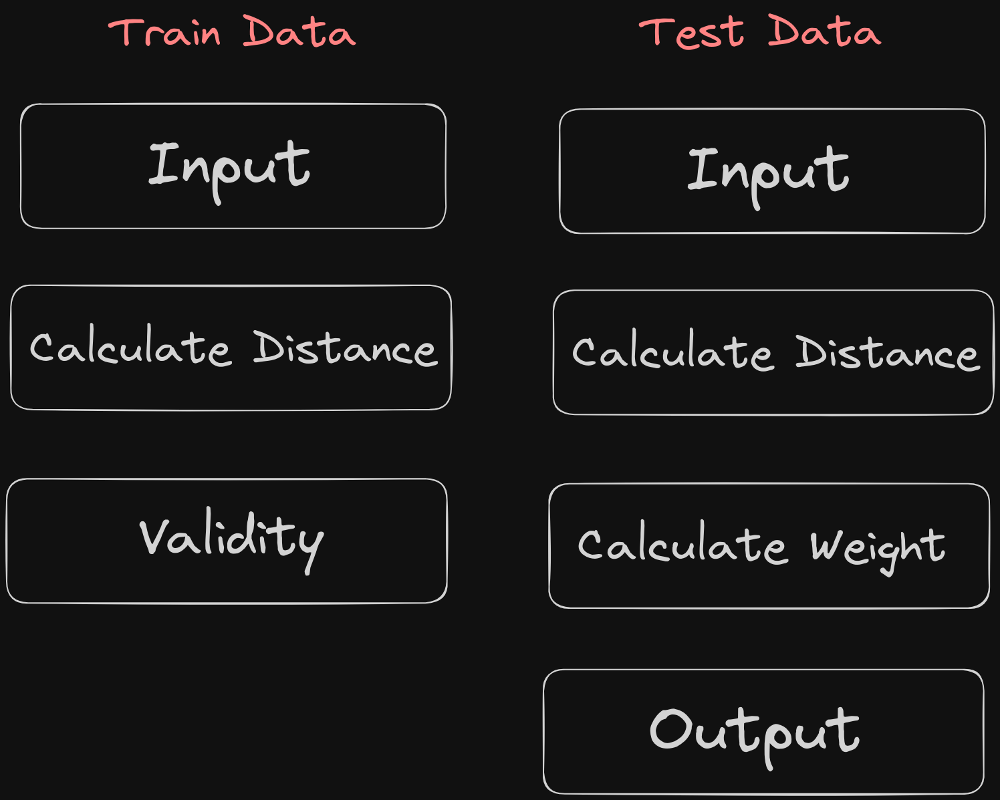

# Modified K-Nearest Neighbors (MKNN)


## Cara Penggunaan

1. **Instalasi**

    ```
    pip install mknn
    ```

2. **Import**


    ```python
    from mknn import MKNN
    ```

3. **Inisialisasi Model**

    Buat objek MKNN dengan parameter yang sesuai, seperti jumlah tetangga (n_neighbors) dan metrik jarak (distance):

    ```python
    mknn = MKNN(n_neighbors=5, distance='euclidean')
    ```

4. **Fit Model**

    Fit model menggunakan data pelatihan (X_train) dan label (y_train):

    ```python
    mknn.fit(X_train, y_train)
    ```

5. **Prediksi**

    Lakukan prediksi pada data uji (X_test):

    ```python
    predictions = mknn.predict(X_test)
    ```

6. **Evaluasi**

    Evaluasi performa model dengan menggunakan metrik-metrik evaluasi yang sesuai seperti akurasi:

    ```python
    accuracy = mknn.score(X_test, y_test)
    ```

7. **Perbandingan dengan KNN Standar**

    Untuk membandingkan performa MKNN dengan KNN standar, gunakan fungsi `compare_with_knn`:

    ```python
    comparison = mknn.compare_with_knn(X_test, y_test)
    ```

    Hasilnya akan berupa sebuah dictionary yang berisi akurasi MKNN dan KNN standar.


## Workflow


1. **Calculate Distance (Train Data)**

    Menghitung jarak antar data latih (euclidean/manhattan).

2. **Validity**

    Apabila label 𝑥 sama dengan label tetangga, maka nilainya adalah 1, dan jika tidak sama, maka nilainya adalah 0.

3. **Calculate Distance(Test Data)**

    Menghitung Jarak Data uji dengan data latih (euclidean/manhattan).

4. **Calculate Weight**

    Menghitung bobot dengan persamaan: 

    $$ W(x) = Validity(i)  {1 \over d(e) + 0.5} $$


## Catatan

Pastikan bahwa data yang Anda gunakan telah diproses dengan benar sesuai dengan kebutuhan algoritma.
